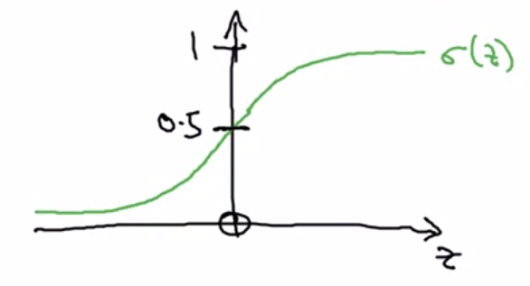
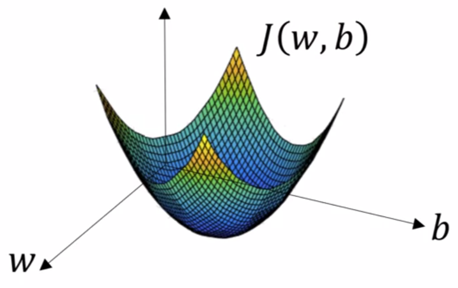
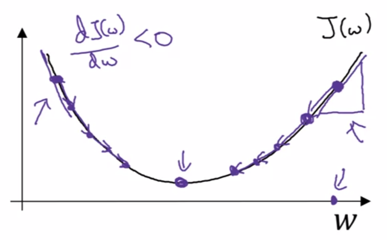
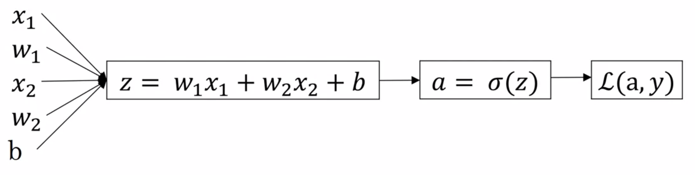

# Deep Learning Basics
## What's Binary Classification?
Binary Classification is a kind of problem in which we want to learn a classifier that can predict the output label from certain input features. 
That label just has two possible values.

## Logistic Regression
Is a learning algorithm suited for binary classification problems, where the output is a 0/1 label.

Given $x \in \mathbb{R}^{n_x}$, want: $$\hat{y} = P(y = 1 | x)$$  
**Parameters**: $w \in \mathbb{R}^{n_x}, b \in \mathbb{R}$  
**Output**: $\hat{y} = \sigma (w^Tx + b)$  

Where $\sigma$ is the sigmoid function:

{width=50%}

$$\sigma (z) = \frac{1}{1 + e^{-z}}$$

### Cost Function
Given ${(x^1, y^1), ..., (x^m, y^m)}$, we want $\hat{y}^i \approx y^i$

Now, we need a function to measure how well our algorithm is doing (**Loss/error function**). For example, we could use:

* $\mathcal{L}(\hat{y},y) = \frac{1}{2}(\hat{y}-y)^2$

The problem is that that function make our **optimization problem non-convex**, what means that will have multiple local optimum and our **Gradient Descent** algorithm may not find the global optimum.

The loss function that we want to really use is: $$\mathcal{L}(\hat{y},y) = -(y \log (\hat{y}) + (1-y) \log(1-\hat{y}))$$

But, we need to know how well is doing the algorithm (the selection of our parameters) in the entire training set, not just a single example. For that reason we need a **Cost function**:
$$J(w,b) = \frac{1}{m} \sum^{m}_{i=1} L(\hat{y}^{(i)},y^{(i)})= -\frac{1}{m} \sum^{m}_{i=1} y^{(i)}\log (y^{(i)}) + (1 - y^{(i)}) \log (1-\hat{y}^{(i)})$$

* **Loss function** ($\mathcal{L}$): Just applied to one single training example.
* **Cost function** ($J$): Cost of our parameter. The average of the loss functions of the entire training set.

## Gradient Descent
Now that we can measure how well our selection of the parameters is, the next logical step would be to determine those parameters trying to maximize how good they are, in other words, minimizing the error made.

Want to find $w,b$ that minimize $J(w,b)$.

{width=50%}  
*Convex (one optimum) error function*

What **Gradient Descent** will do is start at an initial point (initialization) and iteratively take some steps in the steepest downhill direction updating the value of both parameters until it converges to the global optimum.

>Repeat {  
&emsp;$w := w - \alpha \frac{\partial J(w,b)}{\partial w}$ 
>
&emsp;$b := b - \alpha \frac{\partial J(w,b)}{\partial b}$  
}

Where $\alpha$ is a parameter known as ***Learning Rate***.

{width=50%}  
*Two possible execution of Gradient Descent (simplified)*

### Remembering the Chain Rule

>Using the **Chain Rule**  we can decompose some derivatives in other simpler derivatives terms.

Suppose:

$$
a = f(x), x = g(y), y = h(z)
$$
We can compute the derivative $\frac{\partial a}{\partial z}$ like:
$$
\frac{\partial a}{\partial z} \stackrel{(Ch.rule)}{=} \\ 
\frac{\partial a}{\partial y} \frac{\partial y}{\partial z} \stackrel{(Ch.rule)}{=} \frac{\partial a}{\partial x} \frac{\partial x}{\partial y} \frac{\partial y}{\partial z} = \\ 
\frac{\partial f(x)}{\partial x} \frac{\partial g(y)}{\partial y} \frac{\partial h(z)}{\partial z}
$$

With the **Chain Rule** we can compute the product of all of those three derivatives above and calculate $\frac{\partial a}{\partial z}$ easily.

## Applying Gradient Descent to Log. Regression

In order to apply Gradient Descent we just need to compute the derivatives terms of the parameters of our model.

In other words, we just need to go backwards in the *computation graph* to obtain the derivatives with respect to the first terms of the graph: the parameters of our model.

### One example of our training set {#one-example}

{width=60%}  
*Computation graph for Logistic Regression*

* "$da$" $= \frac{\partial \mathcal{L}(a,y)}{\partial a} = - \frac{y}{a} + \frac{1-y}{1-a}$
* "$dz$" $= \frac{\partial \mathcal{L}(a,y)}{\partial z} = \frac{\partial \mathcal{L}}{\partial a} \frac{\partial a}{\partial z} = a - y$
* "$dwi$" $= \frac{\partial \mathcal{L}(a,y)}{\partial w_i} = \frac{\partial \mathcal{L}}{\partial a} \frac{\partial a}{\partial z} \frac{\partial z}{\partial w_i} = x_i \frac{\partial \mathcal{L}}{\partial z}$
* "$db$" $= \frac{\partial \mathcal{L}(a,y)}{\partial b} = \frac{\partial \mathcal{L}}{\partial a} \frac{\partial a}{\partial z} \frac{\partial z}{\partial b} = \frac{\partial \mathcal{L}}{\partial z}$

Pay attention to that the derivatives terms that we want in order to apply **Gradient Descent** are $\frac{\partial \mathcal{L}(a,y)}{\partial w_i}$ and $\frac{\partial \mathcal{L}(a,y)}{\partial b}$

---
\* **Note**: $\frac{\partial a}{\partial z}$ is the derivative of the sigmoid function ($a(1-a)$)

### m examples of our training set

$$
J(w,b) = \frac{1}{m} \sum^m_{i=1} \mathcal{L}(a^{(i)},y^{i})\\
a^{(i)} = \hat{y}^{(i)} = \sigma (z^{(i)}) = \sigma (w^Tx^{(i)} + b)
$$

As we can see, the **Cost function** is the average of the individual losses so we can intuit that the derivative with respect the parameters also is going to be the average, but this time of the derivatives of the individual loss terms.

$$
\frac{\partial}{\partial w_i}J(w,b) = \frac{1}{m} \sum^m_{i=1}\frac{\partial}{\partial w_i} \mathcal{L}(a^{(i)},y^{(i)})
$$

Being $\frac{\partial}{\partial w_i}\mathcal{L}(a,y)$ the derivative term that we computed in the [previous example](#one-example).

#### Algorithm
>**$J=0$; $dw_1=0$; $dw_2=0$; $db=0$** # *accumulators*  
>
>**for $i=1$ to $m$ {**  
**&emsp;&emsp;$z^{(i)} = w^Tx^{(i)} + b$**  
**&emsp;&emsp;$a^{(i)} = \sigma (z^{(i)})$**
>
>**&emsp;&emsp;$J = J + -[y^{(i)}\log a^{(i)} + (1-y^{(i)})\log (1-a^{(i)})]$**  
**&emsp;&emsp;$dz^{(i)} = a^{(i)} - y^{(i)}$**  
>
>**&emsp;&emsp;$dw_1 = dw_1 + x^{(i)}_1 dz^{(i)}$**  
**&emsp;&emsp;$dw_2 = dw_2 + x^{(i)}_2 dz^{(i)}$**  
**&emsp;&emsp;&emsp;&emsp;$\vdots$**  
**&emsp;&emsp;$db = db + dz^{(i)}$**  
**}**  
>
>**$J = J / m$**  
>**$dw_1 = dw_1 / m$**  
**$dw_2 = dw_2 / m$**  
**$db = db / m$**

Now, with all those calculations we can implement **one step** of the **Gradient Descent** algorithm.

>$w_1 := w_1 - \alpha \cdot dw_1$  
>$w_2 := w_2 - \alpha \cdot dw_2$  
>&emsp;&emsp;$\vdots$  
>$b := b - \alpha \cdot db$  